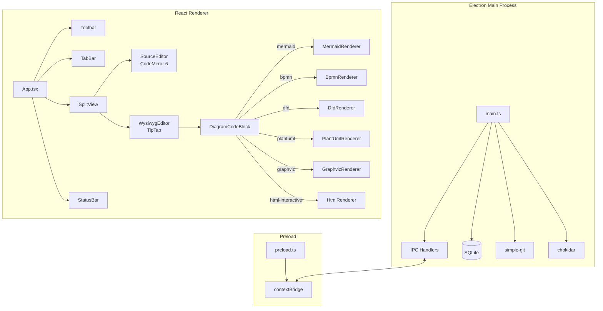

# DrWrite

A desktop markdown editor with split-view editing, 6 diagram renderers, and print-optimized export.

[](https://github.com/nerdykrystal/drwrite/actions/workflows/ci.yml)

## Why This Exists

I work with markdown constantly — pipeline documentation, deliverables, research outputs, learning experiences. Every day I need to edit markdown with a live preview, render embedded diagrams, and export to PDF without converting to .docx first.

No free markdown editor does all of this:

- **Obsidian** doesn't export to PDF natively (needs plugins)
- **Typora** isn't free
- **VS Code** doesn't render diagrams inline in its markdown preview
- None of them let you control print margins and font size from the app itself

I also need to work **offline**. Internet access is a distraction vector for ADHD. A desktop app that works without connectivity removes that entirely.

So I built the tool I needed.

## Features

### Core Editor
- Split-view: CodeMirror source (left) + TipTap WYSIWYG (right)
- Bidirectional sync with 200ms debounce and loop prevention
- Dark mode with OS detection and persistence
- Multi-file tabs with per-tab content caching
- Search and replace (Ctrl+F / Ctrl+H)
- File watching — auto-reload on external changes
- SQLite database for recent files, preferences, window state
- Git status in status bar (branch name, file dirty state)

### Diagram Rendering (6 types)

Each diagram type uses a dedicated renderer — not a single library wrapper.

| Diagram | Renderer | Approach |
|---------|----------|----------|
| Flowcharts, sequence | mermaid.js | Client-side JS |
| BPMN 2.0 | bpmn-js | Dedicated BPMN viewer |
| Data Flow Diagrams | D3.js | Custom-built from scratch |
| UML | PlantUML | Server API encoding |
| Dependency graphs | Graphviz | Client-side WASM |
| Interactive HTML/JS | Sandboxed iframe | D3.js auto-injected |

### Export
- PDF export via Electron printToPDF
- HTML export as self-contained document
- Configurable margins, font size, font family, page numbers
- Settings persist across sessions

## Architecture



## Tech Stack

| Layer | Technology |
|-------|-----------|
| Desktop shell | Electron Forge 7.11 |
| Frontend | React 19, TypeScript |
| Source editor | CodeMirror 6 |
| WYSIWYG editor | TipTap 3 / ProseMirror |
| State management | Zustand 5 |
| Styling | Tailwind CSS v3 + custom design tokens |
| Database | better-sqlite3 (WAL mode) |
| Testing | Vitest + React Testing Library + Playwright |
| Coverage | @vitest/coverage-v8 |
| Build | Vite 5 |

## Engineering Discipline

| Practice | Detail |
|----------|--------|
| Tests | 176 automated (146 Vitest jsdom + 17 Vitest Node + 13 Playwright E2E) |
| Coverage | 67% statements, 100% on utils and key components |
| Pre-push hooks | Prettier + ESLint (zero warnings) + Vitest via Husky |
| Commit conventions | Enforced via commitlint (conventional commits) |
| Linting | ESLint + TypeScript strict mode, zero warnings |
| CI/CD | GitHub Actions: lint, test, build Windows + macOS |
| Security | Sandboxed iframe for user HTML/JS, Electron Fuses, contextBridge IPC |

## Development

```bash
# Install dependencies
npm install

# Run in development
npm start

# Run tests
npm test                    # Unit + component tests (Vitest)
npm run test:node           # Backend tests (Node environment)
npm run test:e2e            # E2E tests (Playwright + Electron)
npm run test:coverage       # Coverage report

# Lint
npm run lint

# Build installers
npm run make                # Windows .exe or macOS .dmg
```

**Known dev issue:** If blank screen on startup, run `rm -rf node_modules/.vite` and relaunch.

## License

MIT
